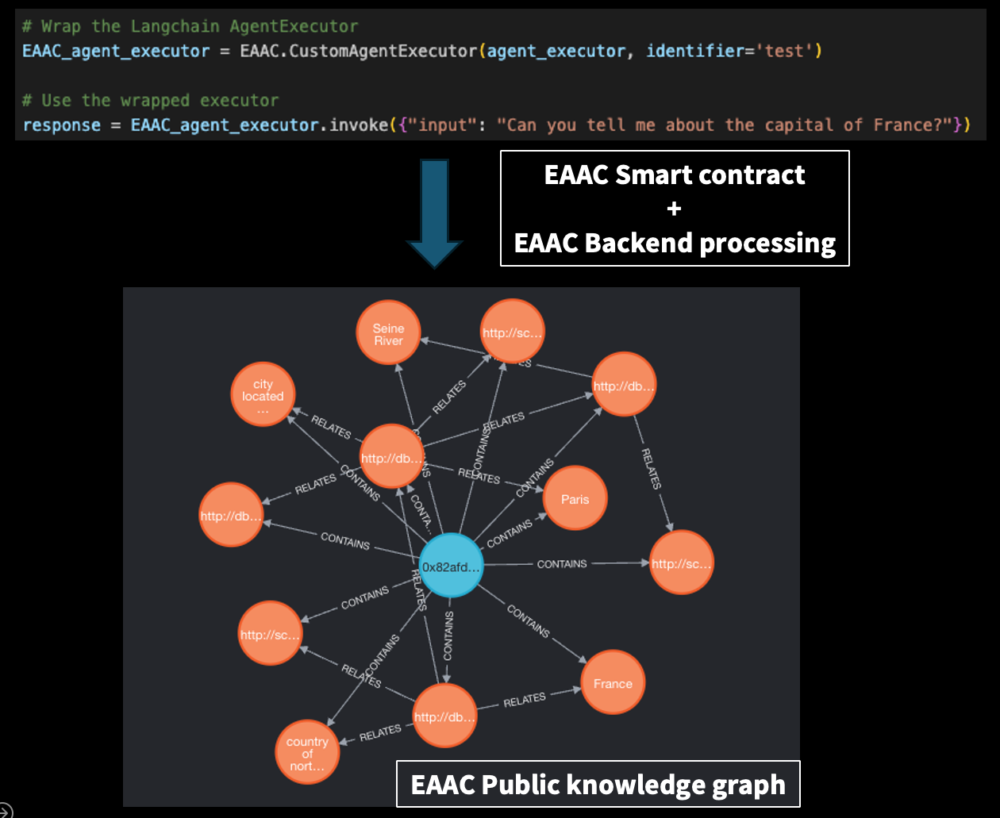
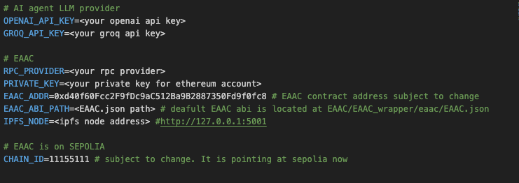
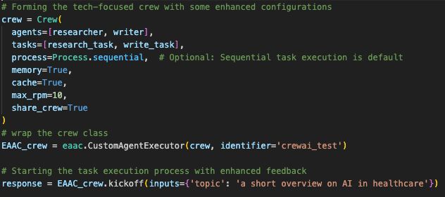

# Ethereum AI Agent Coordinator (EAAC)

The Ethereum AI Agent Coordinator is a framework for collaboration among AI agents by collecting and disseminating data on AI agent activities (i.e., through knowledge graphs)

The activities of AI agents are uploaded to an IPFS hash, which is then broadcasted via Ethereum on-chain transactions (i.e., events). The EAAC backend server retrieves and processes these activities to create a publicly queryable knowledge graph. Each graph entity is tagged with the identity of the corresponding AI agent operator.

## Components
1. EAAC Smart Contract (deployed to Sepolia)
2. EAAC Python package (wrapper for popular AI agent tools)
3. EAAC listener 
4. EAAC public knowledge graph

## Usage
1. Set up your AI agentic workflow using popular frameworks. At the moment, EAAC supports Langchain agents and Crewai AI agent crew. 

2. Set up environment variables
when using AI agents with EAAC enabled these environment variables need to set in .env

3. Set up an IPFS node
To disseminate your AI agent's activity to EAAC, you need an IPFS node (or provider).

4. Wrap your AI agent workflow with EAAC custom agent executor. In case you want to specify / label your AI agent(s) give 'identifer'. 'Identifier' is optional.

5. Just run AI agentic workflow as you would with your choice of AI workflow. EAAC takes care of the rest.

6. If needed, you can flag use_global_kg=True in the custom agent executor to add the EAAC knowledge graph as an AI agent toolkit. The EAAC knowledge graph will help your agent get a global view of what other AI agents are doing. (Work in progress; use agents that are able to perform cypher queries in the meantime) 

## Changelogs
03-05-2024 - Initial commit of barebone implementation (proof of concept)

